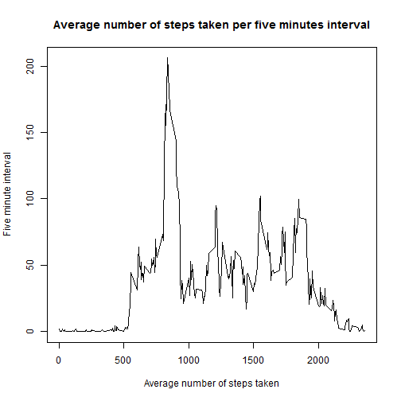

## Introduction

It is now possible to collect a large amount of data about personal movement using activity monitoring devices such as a [Fitbit](http://www.fitbit.com), [Nike Fuelband](http://www.nike.com/us/en_us/c/nikeplus-fuelband), or [Jawbone Up](https://jawbone.com/up). These type of devices are part of the "quantified self" movement -- a group of enthusiasts who take measurements about themselves regularly to improve their health, to find patterns in their behavior, or because they are tech geeks. But these data remain under-utilized both because the raw data are hard to obtain and there is a lack of statistical methods and software for processing and interpreting the data.

This assignment makes use of data from a personal activity monitoring device. This device collects data at 5 minute intervals through out the day. The data consists of two months of data from an anonymous individual collected during the months of October and November, 2012 and include the number of steps taken in 5 minute intervals each day.

## Data

The data for this assignment can be downloaded from the course web site:

* Dataset: [Activity monitoring data](https://d396qusza40orc.cloudfront.net/repdata%2Fdata%2Factivity.zip) [52K]

The variables included in this dataset are:

* **steps**: Number of steps taking in a 5-minute interval (missing values are coded as `NA`)

* **date**: The date on which the measurement was taken in YYYY-MM-DD format

* **interval**: Identifier for the 5-minute interval in which measurement was taken

The dataset is stored in a comma-separated-value (CSV) file and there are a total of 17,568 observations in this dataset.


## Loading and preprocessing the data

Let's load and take a look at the activity data:


```r
unzip("activity.zip")
activity <- read.csv('activity.csv')
head(activity)
```

```
##   steps       date interval
## 1    NA 2012-10-01        0
## 2    NA 2012-10-01        5
## 3    NA 2012-10-01       10
## 4    NA 2012-10-01       15
## 5    NA 2012-10-01       20
## 6    NA 2012-10-01       25
```

```r
str(activity)
```

```
## 'data.frame':	17568 obs. of  3 variables:
##  $ steps   : int  NA NA NA NA NA NA NA NA NA NA ...
##  $ date    : Factor w/ 61 levels "2012-10-01","2012-10-02",..: 1 1 1 1 1 1 1 1 1 1 ...
##  $ interval: int  0 5 10 15 20 25 30 35 40 45 ...
```

## What is mean total number of steps taken per day?

For this part of the assignment, we must make a histogram of the total number of steps taken each day.  We can ignore the missing values in the dataset.

As a first step, let's summarise the data as per our needs:


```r
daily.activity <- ddply(activity, .(date), summarise, 
                        steps = sum(steps, na.rm = TRUE))
head(daily.activity)
```

```
##         date steps
## 1 2012-10-01     0
## 2 2012-10-02   126
## 3 2012-10-03 11352
## 4 2012-10-04 12116
## 5 2012-10-05 13294
## 6 2012-10-06 15420
```

Now, we use this new variable to graph the histogram of steps taken each day:


```r
hist(daily.activity$steps,
     col="red",
     main="Steps taken each day",
     xlab="Steps",
     ylab="Frequency", 
     breaks=50)
```

 

We also must calculate and report the **mean** and **median** total number of steps taken per day: 


```r
mean <- mean(daily.activity$steps)
median <- median(daily.activity$steps)
```

The mean total number of steps taken per day is 9354 steps and the median is 10395 steps.

## What is the average daily activity pattern?

Next, we must make a time series plot (i.e. `type = "l"`) of the 5-minute interval (x-axis) and the average number of steps taken, averaged across all days (y-axis).

First, let's compute the required information:


```r
fivemin.interval.activity <- ddply(activity, .(interval), summarise, 
                                   steps = mean(steps, na.rm = TRUE))
head(fivemin.interval.activity)
```

```
##   interval     steps
## 1        0 1.7169811
## 2        5 0.3396226
## 3       10 0.1320755
## 4       15 0.1509434
## 5       20 0.0754717
## 6       25 2.0943396
```

```r
str(fivemin.interval.activity)
```

```
## 'data.frame':	288 obs. of  2 variables:
##  $ interval: int  0 5 10 15 20 25 30 35 40 45 ...
##  $ steps   : num  1.717 0.3396 0.1321 0.1509 0.0755 ...
```

The following plot shows the average number of steps taken per five minutes interval:


```r
plot(fivemin.interval.activity$interval,
     fivemin.interval.activity$steps, 
     type="l",
     main="Average number of steps taken per five minutes interval",
     xlab="Average number of steps taken",
     ylab="Five minute interval")
```

 

The five minute interval, on average across all the days in the dataset, that contains the maximum number of steps, can be calculated as follows:


```r
max.fivemin.interval.index <- which.max(fivemin.interval.activity$steps)
max.fivemin.interval <- fivemin.interval.activity[max.fivemin.interval.index, ]$interval
```

The interval that corresponds to the maximum number of steps on average across all the days in the dataset is 835.

## Imputing missing values

Note that there are a number of days/intervals where there are missing values (coded as `NA`). The presence of missing days may introduce bias into some calculations or summaries of the data.

The following code snippet calculate the total number of missing values in the dataset (i.e. the total number of rows with `NA`s):


```r
sum(is.na(activity$steps))
```

```
## [1] 2304
```

The assignment asks for devise a strategy for filling in all of the missing values in the dataset  and create a new dataset that is equal to the original dataset but with the missing data filled in: with this information we must be able to analyze the impact of such missing values.

Let's use the average of the five minutes interval accross all days to fill the missing values:


```r
library(data.table)
```

```
## data.table 1.9.4  For help type: ?data.table
## *** NB: by=.EACHI is now explicit. See README to restore previous behaviour.
```

```r
na.filled.activity <- data.table(activity)
na.filled.activity[, per.interval.mean := mean(steps, na.rm = TRUE), by = interval]
na.filled.activity[is.na(steps), steps := as.integer(round(per.interval.mean))]
```

Now, re-apply the previous steps and graph the new histogram:


```r
daily.na.filled.activity <- ddply(na.filled.activity, .(date), summarise, 
                                  steps = sum(steps, na.rm = TRUE))
hist(daily.na.filled.activity$steps,
     col="red",
     main="Steps taken each day (NA filled)",
     xlab="Steps",
     ylab="Frequency", 
     breaks=50)
```

 

The mean imputation tends to remove bias caused by deletion of missing cases. In particular, we can observe how the frequency of the 0 values is highly reduced.


```r
na.filled.mean <- mean(daily.na.filled.activity$steps)
na.filled.median <- median(daily.na.filled.activity$steps)
```

Before the `NA` filling the activity mean was 9354, it is now 10766 and median was 10395, it is now 10762.

## Are there differences in activity patterns between weekdays and weekends?

In order to answer this question, as indicated in the assignment, let's create a new factor variable in the dataset with two levels – “weekday” and “weekend” indicating whether a given date is a weekday or weekend day. We must use the dataset with the filled-in missing values for that:


```r
na.filled.activity <- transform(na.filled.activity, 
    daytype = ifelse(weekdays(as.Date(date)) %in% c("Saturday", "Sunday"), "weekend", "weekday"))
na.filled.activity <- transform(na.filled.activity, daytype = factor(daytype))
na.filled.activity.with.daytype <- ddply(na.filled.activity, 
                                         .(interval, daytype), 
                                         summarise, 
                                         steps = mean(steps))
head(na.filled.activity.with.daytype)
```

```
##   interval daytype     steps
## 1        0 weekday 2.2888889
## 2        0 weekend 0.2500000
## 3        5 weekday 0.4000000
## 4        5 weekend 0.0000000
## 5       10 weekday 0.1555556
## 6       10 weekend 0.0000000
```

```r
str(na.filled.activity.with.daytype)
```

```
## 'data.frame':	576 obs. of  3 variables:
##  $ interval: int  0 0 5 5 10 10 15 15 20 20 ...
##  $ daytype : Factor w/ 2 levels "weekday","weekend": 1 2 1 2 1 2 1 2 1 2 ...
##  $ steps   : num  2.289 0.25 0.4 0 0.156 ...
```

Let's make a panel plot containing a time series plot (i.e. type = "l") of the 5-minute interval (x-axis) and the average number of steps taken, averaged across all weekday days or weekend days (y-axis) to see the differences in activity patterns between weekdays and weekends. We make use of the `lattice` library because the graph should look similar to the one included in the README.md file of the assignment in Github:


```r
library(lattice)

xyplot(steps ~ interval | daytype, 
       na.filled.activity.with.daytype, 
       layout = c(1, 2), 
       type = 'l',
       xlab = "Interval",
       ylab = "Number of steps")
```

 

As the graph suggest, it seems to be two different activity patterns for the weekdays and weekends: in weekdays, the individual walks a lot in the morning compared to the rest of the day; in the weekends, this individual walks quite and in different times of the day.


